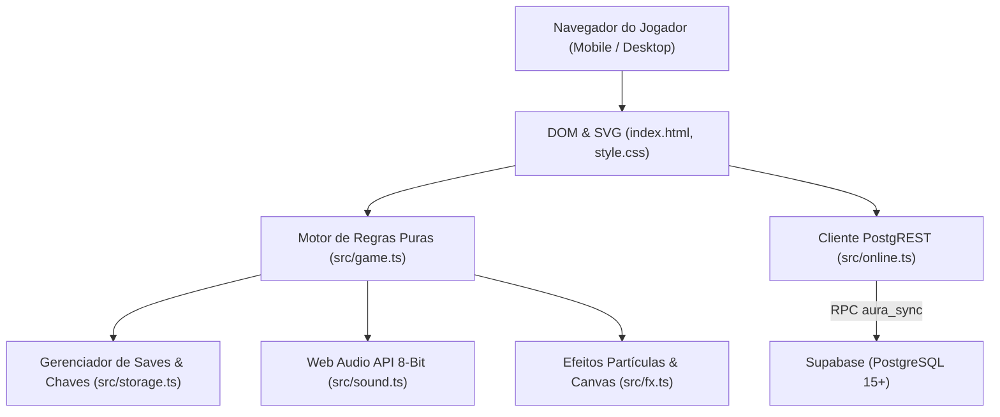

# 🏗️ Arquitetura & Engenharia de Software

O **Clawd Aura Farm** é projetado como uma aplicação web moderna, ultra-leve, offline-first e segura contra trapaças (*server-authoritative*).

---

## 📐 Visão Geral da Stack

| Camada | Tecnologia | Propósito |
|---|---|---|
| **Linguagem & Tipagem** | TypeScript 7+ | Tipagem estrita de regras, eventos e respostas da API |
| **Bundler & Dev Server** | Vite 8+ | Hot Module Replacement (HMR) e build estático de alto desempenho |
| **Testes de Unidade** | Vitest 5+ | Validação das fórmulas do jogo, sincronização com o banco e serialização de dados |
| **Banco & Servidor** | PostgreSQL 15+ (Supabase) | Armazenamento seguro de pontuação, cálculo central de aura e ranking global |
| **Renderização Visual** | HTML5, CSS3, SVG | Pixel art escalável e responsivo com zero perda de qualidade gráfica |
| **Efeitos Visuais** | Canvas 2D | Partículas flutuantes, explosões de clique, raios e tempestade de estrelas |
| **Áudio** | Web Audio API | Síntese de frequências em tempo real (ondas quadradas, triangulares e dente de serra) sem arquivos de áudio pesados |
| **PWA** | Web App Manifest | Permite instalar o jogo na tela inicial de celulares (Android/iOS) como app nativo |

---

## 🔒 Modelo de Segurança e Anti-Cheat

Ao contrário da maioria dos jogos clicker que enviam o saldo de pontos diretamente do cliente para o servidor (o que facilita trapaças no console do navegador), o **Clawd Aura Farm** adota um **modelo estritamente baseado em eventos**:

1. **O Cliente Nunca Envia Saldo de Aura:**
   - O front-end envia apenas códigos de eventos de 1 caractere em lote:
     - `c`: Clique normal realizado
     - `g`: Cérebro Dourado clicado dentro da janela válida
     - `t`: Ladrão capturado dentro da janela válida
     - `a, m, s, f, d, x`: Upgrades comprados
     - `p`: Renascer (prestígio)
     - `K<código>`: Comprar enfeite
     - `E<código>`: Equipar enfeite
     - `U<slot>`: Desequipar enfeite
2. **O Servidor Calcula Toda a Aura:**
   - A função `public.aura_sync(p_id, p_secret, p_events)` roda dentro do PostgreSQL com privilégios `SECURITY DEFINER`.
   - Limite de cliques: Balde de fichas de 15 cliques/segundo com rajada máxima de até 60. Cliques que ultrapassarem o limite são descartados.
   - Aura passiva e janelas temporais de eventos usam exclusivamente o relógio de alta precisão do servidor (`clock_timestamp()`).
3. **Autenticação Criptográfica Segura:**
   - O jogador gera um segredo criptográfico de 256 bits (`p_secret`).
   - O banco de dados armazena apenas o hash `sha256(p_secret)`. Mesmo que a base seja lida por administradores, o segredo nunca é exposto em texto plano.
4. **Política de Segurança de Conteúdo (CSP):**
   - No build de produção gerado pelo Vite, uma meta tag de CSP estrita é injetada no `<head>`.
   - Bloqueia scripts externos, imagens terceiras não autorizadas e conexões de rede para domínios que não sejam o próprio site ou o Supabase configurado.

---

## 📦 Paridade de Testes

O arquivo [`src/schema-sync.test.ts`](file:///home/gabriel/clawd-aura-farm/src/schema-sync.test.ts) analisa por Expressões Regulares o arquivo SQL [`supabase/schema.sql`](file:///home/gabriel/clawd-aura-farm/supabase/schema.sql) e os arquivos TypeScript (`game.ts`, `achievements.ts`, `cosmetics.ts`). Se qualquer número, fórmula, preço ou multiplicador for alterado de um lado e esquecido do outro, a esteira de CI/CD do GitHub Actions rejeita o commit automaticamente.
